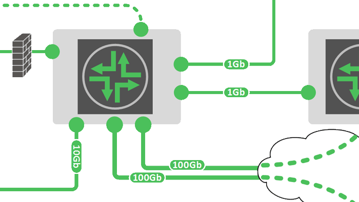

# Der Cumulus-Praktiker

In einem modernen Rechenzentrum müssen die Switches mehr bieten, als Pakete zu transportieren. Hohe Geschwindigkeiten gehören heutzutage zum Standard.
Darüberhinaus muss die Infrastruktur robust, flexibel und sicher sein. Und welche Neuerungen bringen Cloud, Netzwerk-Disaggregation oder das Software-definierten Netzwerk?

__Erh&auml;ltlich ab Juli 2019 als E-Book oder gedrucktes Buch.__

Ein Blick ins [Inhaltsverzeichnis](Inhaltsverzeichnis.md).

## Datacenter-Switching mit Linux

__Cumulus Networks__ tritt die Herausforderung an und erf&uuml;llt die Kriterien auf unterschiedliche Weise. Dieses Buch ist der ideale Begleiter zum Verstehen, Installieren und Einrichten von __Cumulus Linux__ und den Netzen im Rechenzentrum.

Jedes Kapitel erkl&auml;rt eine Problemsituation, beschreibt die theoretischen Grundlagen und stellt ein Laborexperiment zum Nachvollziehen vor. Schlie&szlig;lich zeigt es den L&ouml;sungsansatz mit Methoden von __Cumulus Linux__ und die technischen Hintergr&uuml;nde.

Dieses Buch ist f&uuml;r Linux-Admins, die vom Netzwerk mehr verstehen wollen und f&uuml;r Netzwerker, die Linux besser verstehen wollen. Die Kapitel sind weitgehend unabh&auml;ngig voneinander, steigern sich aber in ihrem Niveau. So sind die Themen geeignet vom Einsteiger bis zum Profi.

## Reinschnuppern

### Leseprobe
Kapitel 8 _Ausfallschutz_ gibt es als kostenlose [Leseprobe](Leseprobe_8_linkagg.pdf) zum Einstimmen auf Cumulus Linux.

### Netzdiagramm
Fast alle Kapitel benutzen denselben Netzaufbau und diegleichen IPv4/IPv6-Adressen. Das Netzdiagramm gibts als Download im Format [PDF](Netzdiagramm.pdf) oder [PNG](Netzdiagramm.png).

## Ressourcen

* Was ist drin im Buch? Ein Blick ins [Inhaltsverzeichnis](Inhaltsverzeichnis.md) zeigt die behandelten Themen.

* Die vollst&auml;ndige [Konfiguration](Kapitel/) der Cumulus-Switches aller Kapitel zum Nachbauen oder f&uuml;rs Verst&auml;ndnis. Dort liegen auch die verwendeten Skripte und Ergebnisse der Messungen.

* Das [Korrekturverzeichnis](errata.pdf) listet die inhaltlichen Fehler und ihre Verbesserung.

* Buch kaufen bei [Amazon](https://www.amazon.de) oder [BoD](https://www.bod.de/buchshop)

* Kontakt zum Autor per [E-Mail](mailto:der.cumulus.praktiker@gmail.com)

* Fehler melden. [E-Mail](mailto:der.cumulus.praktiker@gmail.com?subject=Fehler)

* [Stichwortverzeichnis](Stichwortverzeichnis.pdf)

* [Impressum](Impressum.md)
